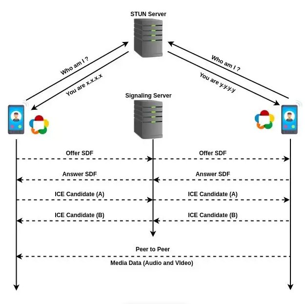
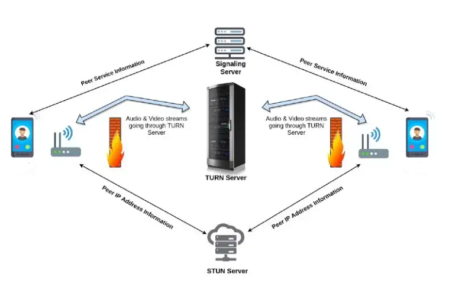

# Zomie - TURN Server


TURN (Traversal Using Relays around NAT) Server handling as relays media, means allows clients(<a href="https://github.com/Mamena2020/zomie-app">zomie app</a>) to send and receive data to <a href="https://github.com/Mamena2020/zomie-server"> Media Server</a> through an intermediary server(TURN server). 
Server running on nodejs, this server work as a backup if STUN Server won't work because client device behind of symmetric NAT.


#WebRTC with <a href="https://medium.com/av-transcode/what-is-webrtc-and-how-to-setup-stun-turn-server-for-webrtc-communication-63314728b9d0">STUN/TURN</a>  

- STUN

- TURN



#how to use
  - config
    - create your .env from .env.example, & fill the credential
    ```
        PORT = 3478

        USERNAME = "zomie"
        PASSWORD = "password"
    ```
  - install
    - npm install
  - dev
    - npm run dev
    - nodemon server
  - prod
    - npm run start
    - node server   

# Note

After running this server don't forget to setup configuration of <a href="https://github.com/Mamena2020/zomie-app">zomie app</a> & <a href="https://github.com/Mamena2020/zomie-server"> Media Server</a>

- Client (<a href="https://github.com/Mamena2020/zomie-app">zomie app</a>)
   - dotenv file
   ```
    ALLOW_TURN_SERVER = "true" 
    TURN_SERVER_HOST = "turn:ip:port" #example: "turn:192.168.1.9:3478"
    TURN_SERVER_USERNAME = "zomie"
    TURN_SERVER_PASSWORD = "password"
   ```

- <a href="https://github.com/Mamena2020/zomie-server">Media Server</a>
   - .env file
   ```
    ALLOW_TURN_SERVER = "true" 
    TURN_SERVER_HOST = "turn:ip:port" #example: "turn:192.168.1.9:3478"
    TURN_SERVER_USERNAME = "zomie"
    TURN_SERVER_PASSWORD = "password"
   ```

- Test STUN/TURN servers
   - https://webrtc.github.io/samples/src/content/peerconnection/trickle-ice/

- Port port for TURN
    ```
      3478 TCP & UDP
      49152–65535 UDP
    ```

# References

- Articles
   - https://bloggeek.me/webrtc-turn/
   - https://bloggeek.me/webrtcglossary/turn/
   - https://medium.com/av-transcode/what-is-webrtc-and-how-to-setup-stun-turn-server-for-webrtc-communication-63314728b9d0
   - https://gabrieltanner.org/blog/turn-server/
- Videos
   - https://www.youtube.com/watch?v=tFniv6VMFwo&ab_channel=EngineeringSemester
- Code
   - https://codesandbox.io/examples/package/node-turn
- Issues
   - https://stackoverflow.com/questions/64446586/webrtc-iceconnectionstatechange-disconnected